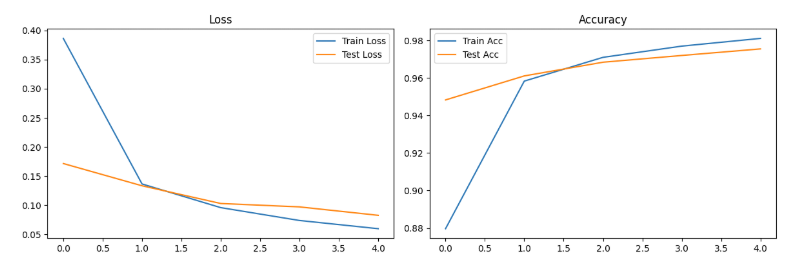

# Задание 1: Эксперименты с глубиной сети:

Взял FullyConnectedModel и через layers накидывал слои. 
У модели с 1 слоем и 7 слоями наблюдалось явное переобучение.
Самой лучшей моделью была модель с 5 слоями и имела Acc: 0.9755.


Я увеличил количество эпох до 15 и модель с 5 слоями, но без Dropout и BatchNorm стала переобучаться и в конце имела Acc: 0.9739.
Затем я добавил Dropout и BatchNorm, модель тоже переобучалась, но имела уже Acc: 0.9831.


# Задание 2: Эксперименты с шириной сети

Модели обучавшиеся на датасете MNIST и имевшая широкий слои ([1024, 512, 256]) переобучивалась:
[1024, 512, 256]


Модели имевшие узкие слои ([64, 32, 16], [256, 128, 64]), показывали хорошую динамику обучения:

[64, 32, 16]


[256, 128, 64]


Модель с самым широким случаем сначала стагнировала, потом имела хроошую динамику обучения:
[2048, 1024, 512]


Затем я попробовал различные схемы изменения ширины:

Для каждой схемы формировалось 4 различных начальных числа нейронов, которое затем с каждым слоем, 
либо увеличивалось, либо уменьшалось, либо оставалось неизменным, все зависило от такого, какя сейчас схема. Всего получилось 12 моделей.

```python
base_sizes = [64, 128, 256, 512]
schemes = ['increasing', 'decreasing', 'constant']
```

Получилась такая тепловая карта:

Имеем 4 модели с одинаковыми высокими точностями(2 модели с сужением ширины и 2 с константными ширинами).
Модели с сужением числом нейронов на каждом слое: [512, 256, 128], [1024, 512, 257] Модели с константным числом нейронов на каждом слое: [256, 256, 256], [512, 512, 512]


Задание 3: Эксперименты с регуляризацией

Было создано 5 конфигов с гиперпараметрами: без регуляризации, с Dropout 0.1, с Dropout 0.3, с Dropout 0.5,
с BatchNorm, с Dropout + BatchNorm и с L2 регуляризацией.


У моделей без регуляризации, с дропаут 0.1, 03 и 05, с batchNorm и с дропаут 0.3 + batchNorm примерно одинаковая точность. 
Модель с дропаут 0.3 + batchNorm имеет наибольшую точность. Хуже всех имеет точность модель с l2 регуляризацией

Лучшая стабильность у модели с BatchNorm. У остальных моделей умеренная стабильность.

# Выводы:

Проведенные эксперименты показали, что оптимальная архитектура для полносвязной сети на MNIST достигается при глубине 5 слоев, 
где модель демонстрирует наивысшую точность (97.55%), при этом увеличение глубины до 7 слоев приводит к переобучению; 

Добавление Dropout и BatchNorm не только снижает переобучение при увеличении эпох, но и повышает точность до 98.31%, что подтверждает критическую важность регуляризации для глубоких сетей. 

В экспериментах с шириной сети наилучшие результаты показали модели с сужающейся архитектурой ([512, 256, 128] и [1024, 512, 256]) или постоянной шириной ([256, 256, 256] и [512, 512, 512]), тогда как модели с узкими слоями ([64, 32, 16]) демонстрировали стабильное обучение без переобучения. 

Среди методов регуляризации комбинация Dropout (0.3) и BatchNorm показала максимальную эффективность и стабильность, в то время как L2-регуляризация оказалась наименее эффективной