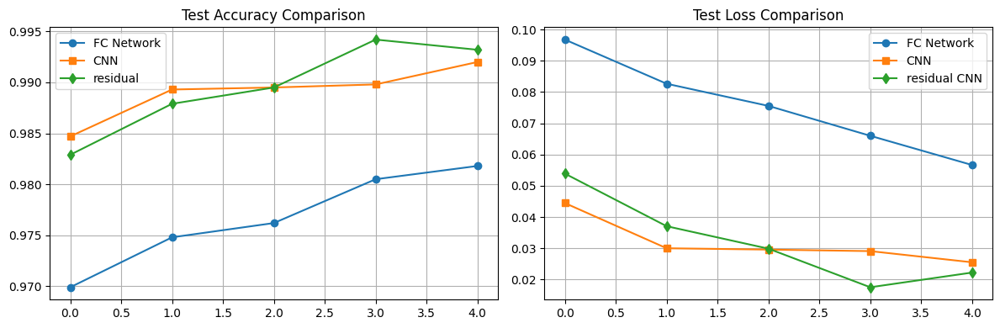
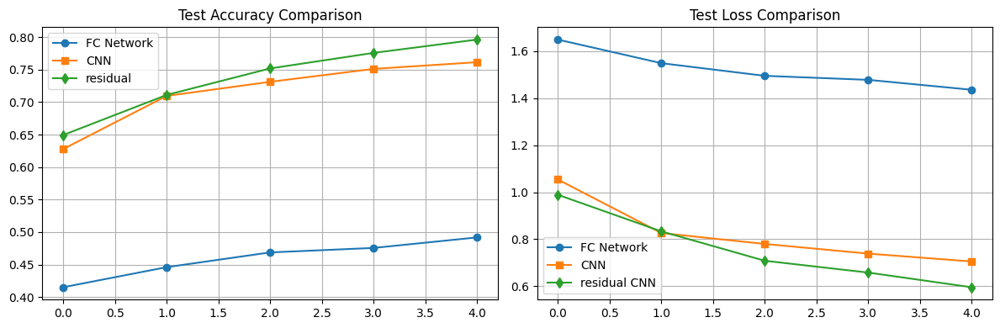
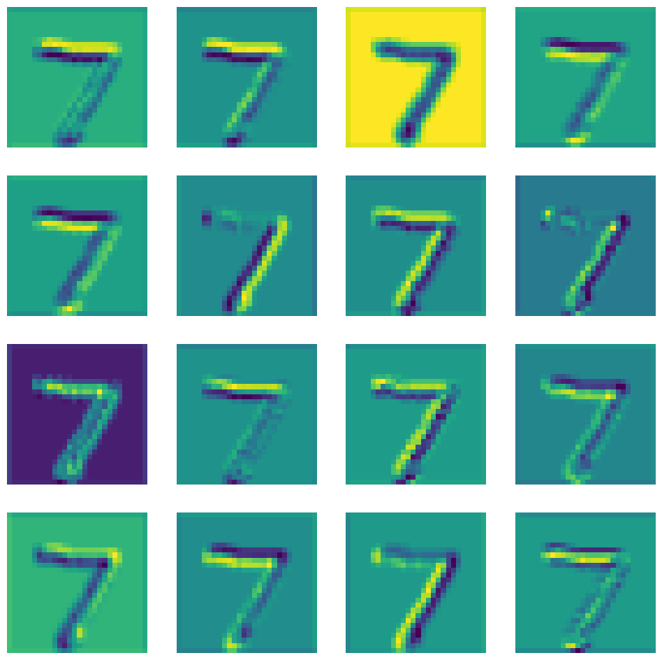
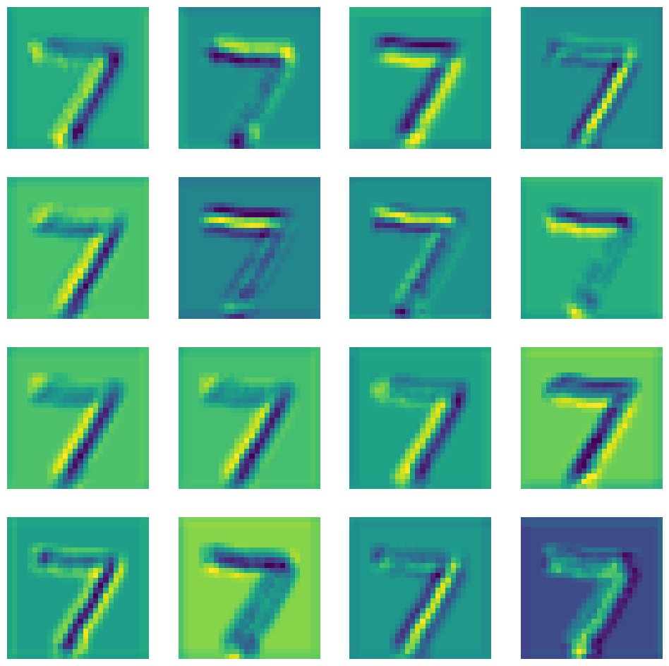
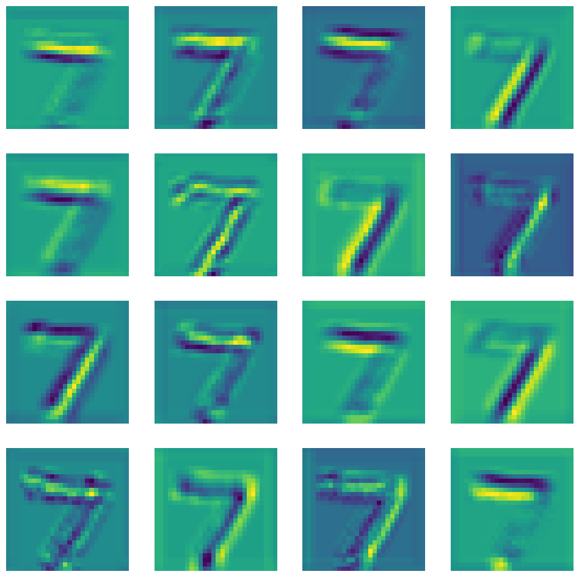
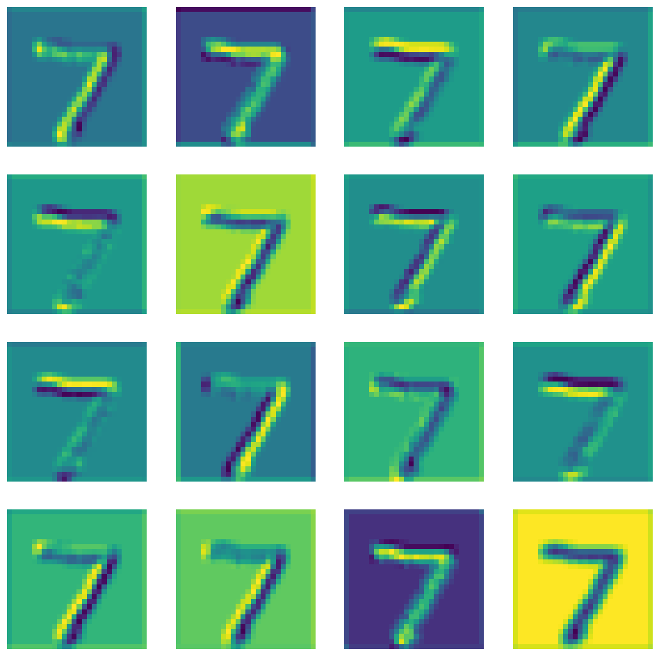
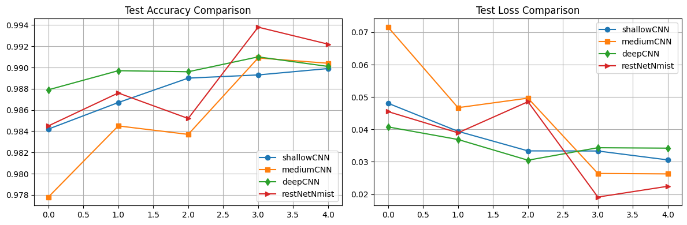
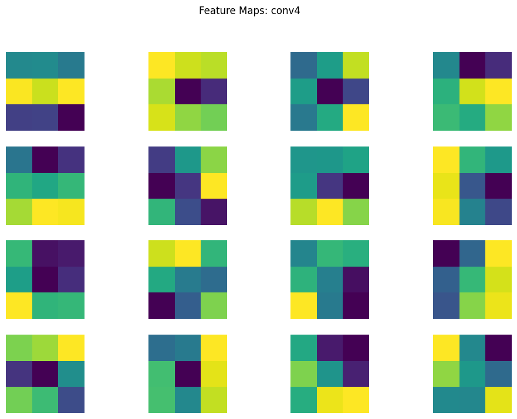

## Задание 1: Сравнение CNN и полносвязных сетей

Эксперимент включал три архитектуры:
- Полносвязная сеть (FC-Model)
- Простая CNN
- CNN с Residual Block

**Результаты для MNIST:**
<ul>
<li>FC-Model: точность 0.9806 (обучение 1м 46с)
<li>Simple CNN: точность 0.992 (обучение 3м 52с)
<li>Residual CNN: точность 0.9924 (обучение 14м 29с)
</ul>

**Наблюдения:**
1. Residual CNN показала максимальную точность (99.24%), достигнув пика на 3-й эпохе
2. Свёрточные архитектуры значительно превзошли полносвязную сеть
3. Residual CNN требует в 4 раза больше времени обучения за минимальный прирост точности
4. Simple CNN демонстрирует потенциал для улучшения при увеличении эпох

**Результаты для CIFAR (оптимизированные модели):**
<ul>
<li>FC-Model: точность 0.4918 (обучение 1м 31с)
<li>Simple CNN: точность 0.7614 (обучение 4м 50с)
<li>Residual CNN: точность 0.8210 (обучение 15м 3с)
</ul>

**Ключевые выводы:**
- Residual CNN сохраняет лидерство по точности (82.1%)
- FC-Model неэффективна для сложных данных
- Все модели демонстрируют потенциал роста при увеличении эпох
- Residual CNN требует непропорционально больше времени (15 мин vs 5 мин)

## Задание 2: Анализ архитектур CNN

**Эксперимент с размерами ядер:**
- Сравнение моделей с ядрами 3×3, 5×5, 7×7 и комбинацией (1×1 + 3×3)

**Результаты:**
- Максимальная точность: ядро 7×7
- Наименьшая точность: ядро 3×3 и комбинированное
- Парадокс: модель 3×3 показала лучший loss при низкой точности
- Все модели демонстрировали переобучение

**Визуализация активаций:**
- Модель 3×3: 
- Модель 5×5: 
- Модель 7×7: 
- Комбинированная: 

**Эксперимент с глубиной сетей:**
- Сравнение 4 архитектур: 2, 4 и 6 свёрточных слоёв + ResNet

**Результаты:**
<ul>
<li>ResNet: 2.8M параметров (обучение 40 мин), точность 0.9938
<li>Другие модели: ≈50K параметров (обучение ≈3 мин), точность 0.9909-0.9910
</ul>

**Анализ карт признаков:**
1. Первые слои всех моделей выделяют схожие паттерны
2. Модель с 4 свёрточными слоями показывает артефакты на последнем слое:
   
3. Причина: использование AdaptiveAvgPool2d → чрезмерное сжатие признаков
4. Несмотря на артефакты, точность модели остаётся высокой (99.09%)

**Наблюдения:**
- ResNet показывает лучший результат, но требует в 56 раз больше параметров
- Все модели (кроме 2-слойной) начинают переобучаться после 3-й эпохи
- Глубокие сети без residual-связей сохраняют конкурентоспособную точность