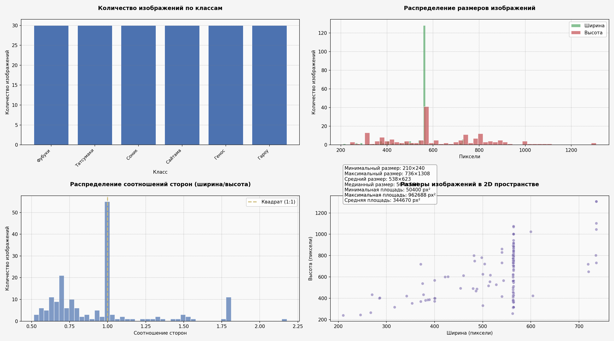
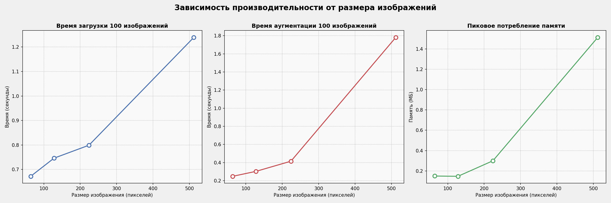
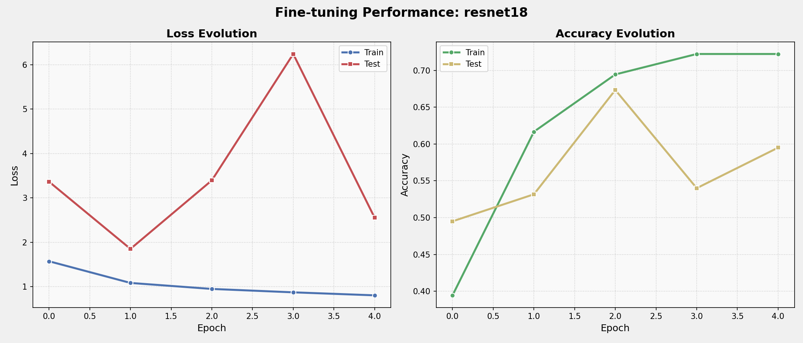
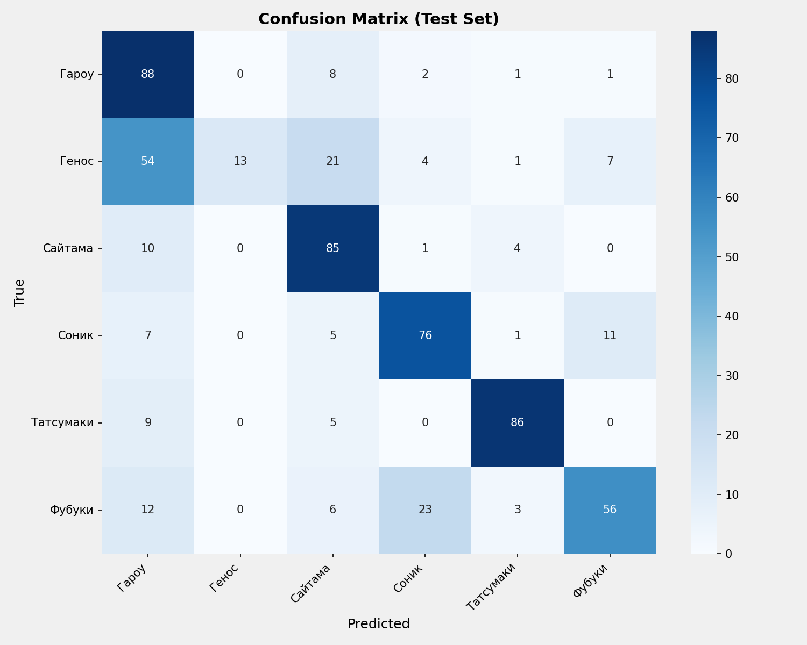

## Часть 1: Исследование стандартных методов аугментации (15 баллов)

Сдеалал комплексный пайплайн преобразований изображений с использованием стандартных аугментаций библиотеки torchvision. Визуальный анализ результатов демонстрирует эффективность применённых трансформаций для различных классов изображений. Изображения можно посмотреть в файле task1.ipynb в этой директории

## Часть 2: Разработка специализированных аугментаций (20 баллов)

На втором этапе были успешно реализованы три новых метода преобразования изображений:

RandomBlur - алгоритм адаптивного размытия

RandomPerspective - трансформация перспективы

RandomBrightnessContrast - коррекция яркости и контраста

Изображения можно посмотреть в файле task2.ipynb в этой же директории

## Часть 3: Статистический анализ датасета (10 баллов)

Проведён  анализ исходного набора данных, выявивший следующие характеристики:

Объём данных: 180 изображений

Классовая структура: 6 равномерно представленных категорий

Размерные характеристики:

Среднее разрешение: 539×624 пикселей

Диапазон вариации: от 210×240 до 736×1308 пикселей

## Часть 4: Система управления аугментациями (20 баллов)

Сделал гибкий инструментарий AugmentationPipeline, предоставляющий:

Динамическое добавление/удаление преобразований

Три предустановленных профиля интенсивности (лёгкий, средний, тяжелый)

Унифицированный интерфейс применения

Результаты работы сохранены в папке augs текущей директории.

## Часть 5: Оптимизация размеров изображений (10 баллов)
Экспериментальное исследование выявило зависимость между размером изображений и:

Временем обработки (от 0.62с до 1.92с)

Потреблением памяти (от 0.15МБ до 1.51МБ)

## Часть 6: Трансферное обучение (25 баллов)
Для решения задачи классификации выбрана архитектура ResNet18, показавшая:

Начальную точность: 66%

Финальную точность: 73.8%

Матрица ошибок:

Заключение и выводы
Проведённое исследование наглядно продемонстрировало ключевую роль аугментаций в процессе подготовки данных для задач компьютерного зрения. Разработанные методы позволяют:

Существенно расширить разнообразие обучающей выборки

Повысить устойчивость моделей к вариациям входных данных

Оптимизировать вычислительные ресурсы